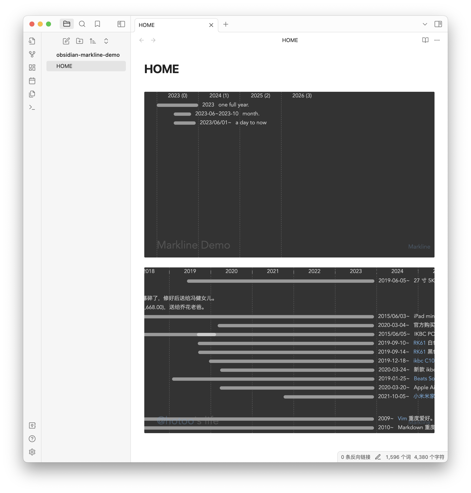

# Obsidian Markline

This is fork of [Markline](https://github.com/hotoo/markline), show timeline view from markdown in Obsidian editor.

## Feature

- Show timeline view in Obsidian Editor with `markline` code blockquote.
- Add markline code blockquote by command.



## Install

Manual installation:

Unzip the [latest release](https://github.com/hotoo/obsidian-markline/releases/latest) into your `<vault>/.obsidian/plugins/markline` folder.

## Examples

```markdown
```markline
# My Documnet Title

## group name (optional)

- 2023 A full year event.
  - 2023-01~2023-03 subevent
  - 2023-05~2023-08 subevent 2
- 2023-01 month event name.
- 2023-01-02 event name with [link](https://github.com/hotoo/obsidian-markline).

## another group

- 2013 another list item.
- 2013-05-05 yet another list item.
```‌
```

## Markdown

Markdown is so easy, and so powerful, you can use it to build the timeline graph.

Markline use subsets of markdown now:

### Dates

```markdown
* 1986 for year.
* 1986/06 for month.
* 1986/06/28 is a good day.
* 1986-06-28 you also can use this date formart.
```

### Date Ranges

```markdown
* 2012~2014 year to year.
* 2012~2014/02 year to year.
* 1986/06/28~1986/08/14 from date to another date.
* 2012~ year to now.
```

### Header

```markdown
# title

## h2 group name
### h3 group name
#### h4 group name
##### h5 group name
###### h6 group name
```

### Meta

Between title and group or lines, we can set meta data in markdown by key-value pair.

```markdown
# title

- age: show
- date: 2014/01/01
- author: @hotoo
- mention: https://twitter.com/{@mention}

----

# Group 1

* 2014 line 1.
```

Now we support meta data:

* `age`: show age after year in top header line. default is hide, if want show, set:

  ```markdown
  - age: show
  ```
* `mention`: set mention enable, and mention base url. default mention is disable.

  ```md
  # @Mention Demo

  - mention: https://github.com/{@mention}

  ----

  - 2014 @hotoo mention @lizzie
  ```

  `{@mention}` is placeholder for mention name.

* `hashtag`: custom hashtag styles.

  ```md
  # #HashTag Demo

  - hashtag:
    - tag-name: text-color, background-color
    - life: yellow, #f00
    - job: rgb(255,255,255), rgba(255,0,0,0.5)

  ----

  - 2014 this is my #life
  ```

following meta data support come soon.

* `theme`: set different theme, by build-in theme name, or theme css file url.

  ```markdown
  - theme: light
  - theme: http://www.example.com/theme.css
  ```
* `year-length`: set date column width.
* `date-type`: show date type by `year`, `month`, or `date`
* `author`: set author information.

### List

```markdown
* 2014 list item
  * 2014/01 sub list item

- 2014 another list item
  - 2014/01 another sub list item
```

### Horizontal

for anonymous group.

```markdown
* 2014 line 1

----

* 2015 line 2
```

### Link

```markdown
* 2014 this is a  [link](url)
```

### Image

```markdown
* 2014 this is an image: 
```

### Strong

```markdown
* 2014 this is **strong** text.
* 2014 this is __another strong__ text.
```

### Emphasized

```markdown
* 2014 this is _emphasized_ text.
* 2014 this is *another emphasized* text.
```

### Delete

```markdown
* 2014 this is ~delete~ text.
* 2014 this is ~~another delete~~ text.
```

Want more markdown syntax feature? make [issues](https://github.com/hotoo/obsidian-markline/issues), fork and pull request.

### References

* [Markdown Syntax](http://daringfireball.net/projects/markdown/syntax)
